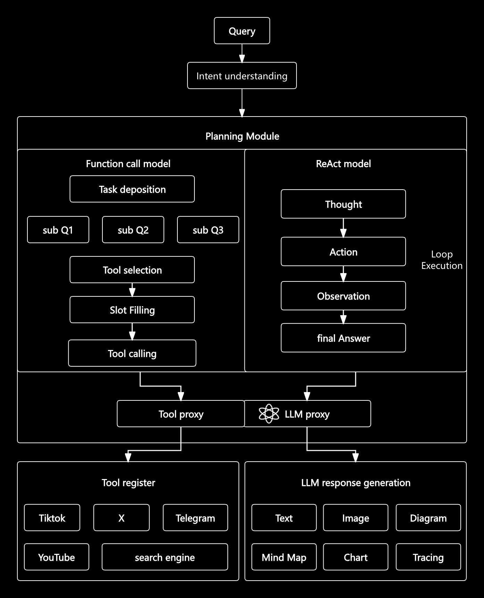

# Prism

## Introduction

Welcome to the Prism Project! This project base on LLM to provide powerful AI search capabilities. 

With Prism, you can easily verify each answer in real time by checking live references, giving you confidence in the answers.

## Try with Prism

TODO

## Architecture

## Key Features

- The answers can be traced back through references
- Visualize the answer using a mind map
- A wealth of references sources are currently supported, including X (Twitter) and Google Search.
- Built-in observability based on Opentelemetry
- Fully asynchronous supported
- Concurrent retrieval
- 

## Contributing
